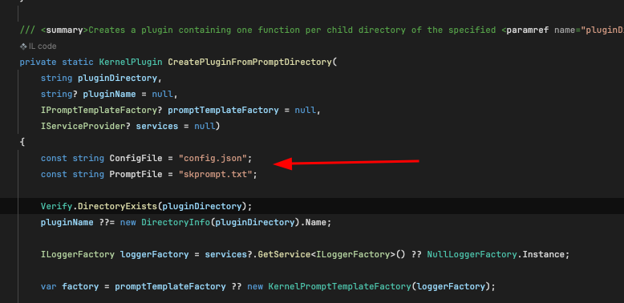
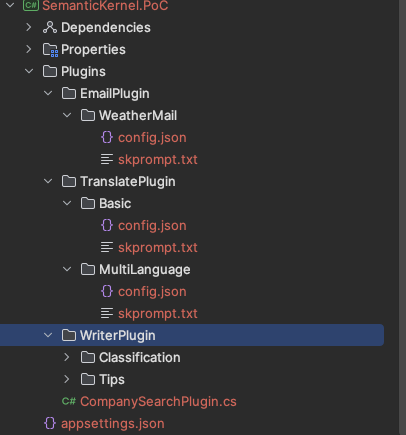
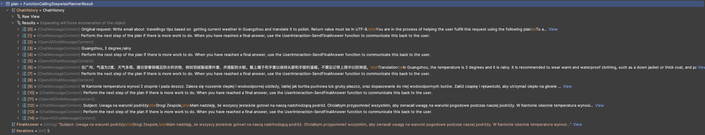

# Semantic Kernel planner with text functions PoC
There are avaiable two planners:
- `FunctionCallingStepwisePlanner`
- `HandlebarsPlanner` 

# Text plugins convention

Functions in file prompt has to have 2 files:
- `config.json`: where you keep description, and information about Open AI limits like maxTokens, temperature etc.
- `skprompt.txt`: Prompt that is used in function



Plugins are bounded group of functions. Each fucntion has to posses own folder.



You can override the plugins detecting patterns - but in my option it might only broke something - the framework is not stable 

During the calling into planner you have to registr plugins like that:
```c#
builder.Services.AddKernel()
    .Plugins
    .AddFromObject(new CompanySearchPlugin(), "CompanyPlugin")
    .AddFromPromptDirectory(Path.Combine(pluginDirectory, "WriterPlugin"))
    .AddFromPromptDirectory(Path.Combine(pluginDirectory, "EmailPlugin"))
    .AddFromPromptDirectory(Path.Combine(pluginDirectory, "TranslatePlugin"));
```

# HandlebarsPlanner

Planner generate prompt with seqentials steps that have to invoke. Based on this steps list the semantic kernel will use to generate final answers


## Example 

calling: {SemanticKernel.PoC_HostAddress}}/ask2/ with "Write email about  travellings tips based on  getting current weather in Guangzhou and translate it to polish."

received steps from planner actions:

```
      {{!-- Step 1: Get current weather in Guangzhou --}}
      {{set "weatherInfo" (CompanyPlugin-WeatherSearch city="Guangzhou")}}
      
      {{!-- Step 2: Generate travel tips based on the weather --}}
      {{set "travelTips" (WriterPlugin-Tips input=weatherInfo language="English")}}
      
      {{!-- Step 3: Translate the travel tips to Polish --}}
      {{set "translatedTips" (TranslatePlugin-MultiLanguage input=travelTips language="Polish")}}
      
      {{!-- Step 4: Write an email about the travel tips --}}
      {{set "emailContent" (EmailPlugin-WeatherMail input=translatedTips)}}

      {{!-- Step 5: Output the email content in UTF-8 --}}
      {{json emailContent}}

```

received output:
```
Temat: Ważne przypomnienie: Pogoda i wskazówki dotyczące ubioru na podróż do Guangzhou

Drodzy Koledzy,

Mam nadzieję, że ten email zastanie Was w dobrym zdrowiu. W związku z naszą zbliżającą siępodróżą do Guangzhou, chciałbym przypomnieć wszystkim, aby zwracali uwagę na warunki podróży w każdym momencie. Prognoza pogody wskazuje, że będzie 2 stopnie i deszczowo.

Proszę upewnijcie się, że ubierzecie się odpowiednio i bądźcie na bieżąco ze zmianami w warunkach pogodowych. Wasze bezpieczeństwo i komfort podczas podróży są dla nas najważniejsze.

Dziękuję za uwagę poświęconą tej sprawie.

Z poważaniem,

[Twoje Imię]
```

# FunctionCallingStepwisePlanner

Planner just call to Open AI and ask which function should invoke based on previouse output. 

calling: {SemanticKernel.PoC_HostAddress}}/ask/ with "Write email in polish about travelings tips based on  getting current weather in Guangzhou."

received steps:


```
Subject: Uwaga na warunki podróży

Drogi Zespole,

Mam nadzieję, że wszyscy jesteście gotowi na naszą nadchodzącą podróż. Chciałbym przypomnieć wszystkim, aby zwracali uwagę na warunki pogodowe podczas naszej podróży. W Kantonie obecnie panuje temperatura 2 stopnie i deszczowa pogoda. Zaleca się noszenie grubych i ciepłych ubrań, takich jak kurtka puchowa lub gruby sweter. Najlepiej jest je połączyć z wodoodporną kurtką i kaloszami, aby utrzymać ciało w suchości. Ponadto, warto zabrać ze sobą parasol na wszelki wypadek.

Proszę, aby każdy z Was był przygotowany i zwracał uwagę na warunki podróży w każdej chwili. Bezpieczeństwo i komfort są dla nas priorytetem.

Dziękuję i do zobaczenia wkrótce!

Pozdrawiam,
[Twoje Imię]
```